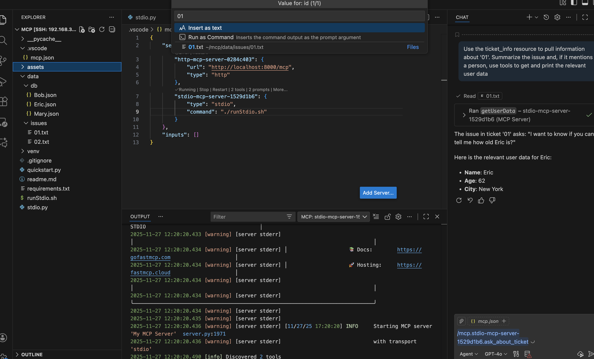

# Setup

once ever:
```
python3 -m venv venv
source venv/bin/activate
python3 -m pip install fastmcp
```

once per session:
```
source venv/bin/activate
python3 quickstart.py
```

To iterate:
1. in vscode, ctrl/command+shift+p, then choose "MCP: Reset Cached Tools"

# What Works
* \#add will multiply numbers.  I'm intentionally doing the wrong operation to differentiate from copilot itself
* When you ask things about tailscale, it'll hit the blog post.  I can't tell if/how it uses that page.
* a stdio MCP server that will make requests out to this repo and answer questions

# Demo
After adding the stdio mcp server (already in the .vscode dir), open the chat window.  Type `/mcp.` and let it autocomplete.  Use the "ask_about_ticket" prompt.  VSCode will ask you for an id.  Enter "01" or "02".  

From there, it'll use the resource to pull the "ticket."  From the ticket, it should use the `getUserData` tool to display relevant information about the user described in the ticket.



